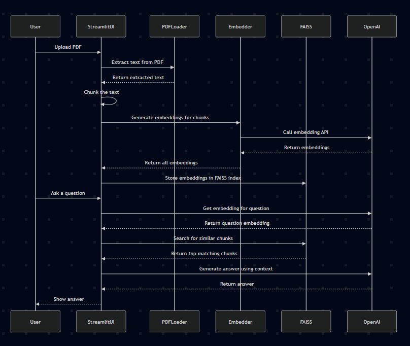

# DocxBot

A Streamlit web application that allows you to upload a PDF document, create semantic embeddings of its content using OpenAI, and ask questions about the document. The app retrieves the most relevant text chunks and generates answers using OpenAI's language model.

---

## Features

- Upload PDF files and extract text content.
- Split text into manageable chunks with overlap.
- Generate semantic embeddings for each chunk.
- Index embeddings with FAISS for fast similarity search.
- Ask natural language questions related to the PDF content.
- Receive context-aware answers generated by OpenAI.

---

### Prerequisites

- Python 3.7 or higher
- OpenAI API Key (sign up at [OpenAI](https://platform.openai.com/))
- Required Python packages (see requirements below)

